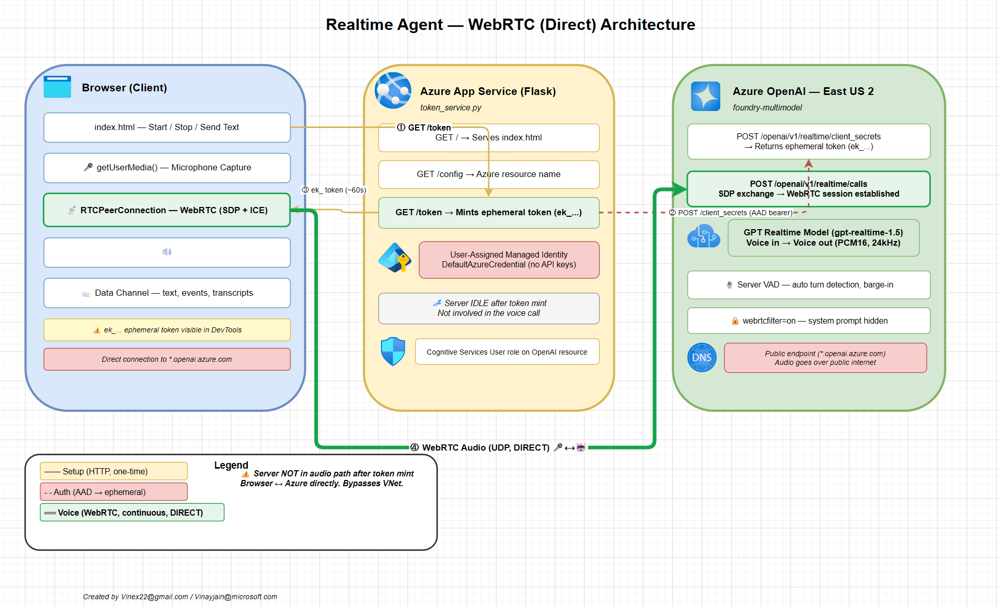
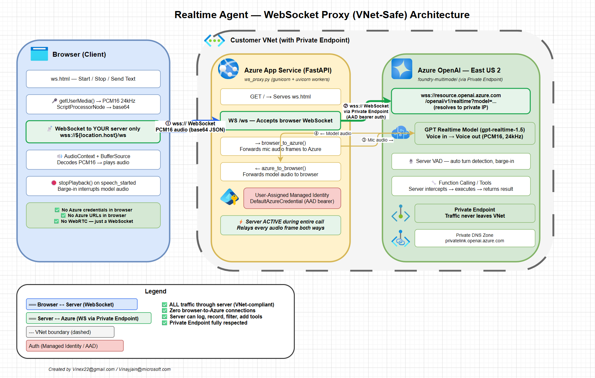

# 🎙️ realtime-agent

[](https://python.org)
[](https://learn.microsoft.com/en-us/azure/ai-foundry/openai/how-to/realtime-audio-webrtc)
[](LICENSE)
[](#)

> **Build real-time voice AI agents on Azure OpenAI** — two production-ready implementations with zero API keys, managed identity auth, and full deployment guides.
>
> Created by **[Vinayjain@microsoft.com](mailto:vinayjain@microsoft.com)** / **[Vinex22@gmail.com](mailto:vinex22@gmail.com)**

---

## 🔥 What is this?

A complete sample for building **voice-based AI assistants** using the [Azure OpenAI GPT Realtime API](https://learn.microsoft.com/en-us/azure/ai-foundry/openai/how-to/realtime-audio-webrtc). Talk to GPT models in real-time — like a phone call with AI. Two architectures included:

| | 🌐 **WebRTC** — Direct | 🔒 **WebSocket Proxy** — VNet-Safe |
|---|---|---|
| Audio path | Browser ↔ Azure **directly** | Browser ↔ **your server** ↔ Azure |
| Server role | Mint token, serve page, go idle | Active relay for every audio frame |
| VNet / Private Endpoint | ❌ Audio bypasses it | ✅ Fully respected |
| Latency | ~200-400ms | ~300-600ms |
| Server framework | Flask | FastAPI + uvicorn |
| Function calling / Tools | ❌ No server in the loop | ✅ Server can intercept and execute |
| Best for | Low latency, demos, internal tools | Production, compliance, regulated industries |

---

## 🏗️ Architecture

### WebRTC (Direct)

The server mints a disposable token, then the browser talks **directly** to Azure OpenAI over WebRTC. Server goes idle.



### WebSocket Proxy (VNet-Safe)

All audio flows through your server. Browser never contacts Azure. Compatible with Private Endpoints and VNet injection.



---

## 📋 Table of Contents

- [Prerequisites](#-prerequisites-both-versions)
- [Project Structure](#-project-structure)
- [Configuration](#️-configuration)
- [Version 1: WebRTC (Direct)](#-version-1-webrtc-direct)
- [Version 2: WebSocket Proxy (VNet-Safe)](#-version-2-websocket-proxy-vnet-safe)
- [Proving No Direct Communication](#-proving-no-direct-communication-websocket-proxy)
- [Debug Tool (inspect_session.py)](#-inspect_sessionpy-debug-tool)
- [Troubleshooting](#️-troubleshooting)

---

## ✅ Prerequisites (both versions)

1. **Azure OpenAI / Foundry resource** in **East US 2** or **Sweden Central**
2. A **realtime model deployment** (e.g. `gpt-realtime-1.5`, `gpt-4o-realtime-preview`, `gpt-realtime-mini`)
3. **Cognitive Services User** role assigned on the resource for your identity (or managed identity)
4. **Python 3.12+**
5. **az login** completed (for local dev)

---

## 📁 Project Structure

```
realtime-agent/
├── .env                        # shared config (both versions read this)
├── .env.example                # template
├── .gitignore
├── README.md
├── inspect_session.py          # debug tool — fetches token from webapp, opens WS, prints events
├── webrtc/                     # Version 1: WebRTC (direct browser-to-Azure)
│   ├── token_service.py        # Flask server
│   ├── requirements.txt
│   ├── architecture.drawio     # draw.io architecture diagram
│   ├── arch-webrtc.png         # PNG export of architecture
│   └── static/
│       └── index.html          # browser client
└── websocket/                  # Version 2: WebSocket Proxy (all traffic through server)
    ├── ws_proxy.py             # FastAPI server
    ├── requirements.txt
    ├── architecture.drawio     # draw.io architecture diagram
    ├── arch-websocket.png      # PNG export of architecture
    └── static/
        └── ws.html             # browser client
```

---

## ⚙️ Configuration

Copy `.env.example` to `.env` and fill in:

```dotenv
AZURE_RESOURCE=your-resource-name          # the <resource> in https://<resource>.openai.azure.com
REALTIME_DEPLOYMENT=gpt-realtime-1.5       # your realtime model deployment name
REALTIME_VOICE=marin                        # alloy|ash|ballad|coral|echo|sage|shimmer|verse|marin
REALTIME_INSTRUCTIONS=You are a helpful assistant.   # system prompt
```

---

## 🌐 Version 1: WebRTC (Direct)

### How it works

```
Browser ──GET /token──> Flask Server ──POST /client_secrets──> Azure OpenAI
Browser <──ek_token───< Flask Server <──ek_token─────────────< Azure OpenAI
Browser ═══════════════ WebRTC audio (direct) ════════════════> Azure OpenAI
```

The server mints an ephemeral token (~60s lifetime), hands it to the browser,
then the browser connects directly to Azure over WebRTC. Server is not involved after that.

### Local development

```powershell
cd webrtc
python -m venv .venv
.\.venv\Scripts\Activate.ps1
pip install -r requirements.txt
az login
python token_service.py
```

Open http://localhost:5000

### Endpoints

| Route | Method | Purpose |
|---|---|---|
| `/` | GET | Serves `static/index.html` |
| `/config` | GET | Returns `{ "azureResource": "..." }` |
| `/token` | GET | Mints ephemeral token via `/openai/v1/realtime/client_secrets` |
| `/connect` | POST | Optional SDP proxy + background WebSocket observer |

### Deploy to Azure App Service

```powershell
# 1. Create resource group (skip if exists)
az group create -n realtime-agent -l centralindia

# 2. Create App Service Plan (Linux)
az appservice plan create -g realtime-agent -n rta-plan --sku B2 --is-linux

# 3. Create web app with user-assigned managed identity
az webapp create -g realtime-agent -p rta-plan -n <app-name> --runtime "PYTHON:3.12"

# 4. Create and assign user-assigned managed identity
az identity create -g realtime-agent -n rta-identity
MI_ID=$(az identity show -g realtime-agent -n rta-identity --query id -o tsv)
MI_CLIENT=$(az identity show -g realtime-agent -n rta-identity --query clientId -o tsv)
MI_PRINCIPAL=$(az identity show -g realtime-agent -n rta-identity --query principalId -o tsv)
az webapp identity assign -g realtime-agent -n <app-name> --identities $MI_ID

# 5. Grant Cognitive Services User on your OpenAI resource
SCOPE=$(az cognitiveservices account show -g <openai-rg> -n <openai-resource> --query id -o tsv)
az role assignment create \
  --assignee-object-id $MI_PRINCIPAL \
  --assignee-principal-type ServicePrincipal \
  --role "Cognitive Services User" \
  --scope $SCOPE

# 6. Configure app settings
az webapp config appsettings set -g realtime-agent -n <app-name> --settings \
  AZURE_CLIENT_ID=$MI_CLIENT \
  AZURE_RESOURCE=<openai-resource> \
  REALTIME_DEPLOYMENT=gpt-realtime-1.5 \
  REALTIME_VOICE=marin \
  "REALTIME_INSTRUCTIONS=You are a helpful assistant." \
  SCM_DO_BUILD_DURING_DEPLOYMENT=true \
  ENABLE_ORYX_BUILD=true

# 7. Configure startup command, WebSockets, HTTPS
az webapp config set -g realtime-agent -n <app-name> \
  --startup-file "gunicorn --bind=0.0.0.0:8000 --workers=2 --timeout=120 token_service:app" \
  --web-sockets-enabled true \
  --always-on true \
  --min-tls-version 1.2
az webapp update -g realtime-agent -n <app-name> --https-only true

# 8. Deploy
cd webrtc
Compress-Archive -Path token_service.py, requirements.txt, static -DestinationPath deploy.zip -Force
az webapp deploy -g realtime-agent -n <app-name> --src-path deploy.zip --type zip

# 9. Verify
curl https://<app-name>.azurewebsites.net/token
```

---

## 🔒 Version 2: WebSocket Proxy (VNet-safe)

### How it works

```
Browser ──wss /ws──> FastAPI Server ──wss──> Azure OpenAI
Browser <──audio───< FastAPI Server <──audio──< Azure OpenAI
```

Every audio frame passes through your server. The browser never talks to Azure directly.
No Azure credentials or endpoints are exposed to the browser.

### Local development

```powershell
cd websocket
python -m venv .venv
.\.venv\Scripts\Activate.ps1
pip install -r requirements.txt
az login
uvicorn ws_proxy:app --port 5001
```

Open http://localhost:5001

### Endpoints

| Route | Method | Purpose |
|---|---|---|
| `/` | GET | Serves `static/ws.html` |
| `/ws` | WebSocket | Bidirectional relay: browser audio <-> Azure OpenAI |

### Deploy to Azure App Service

```powershell
# 1. Create resource group (skip if exists)
az group create -n realtime-agent -l centralindia

# 2. Create App Service Plan (Linux, B2 or higher for WebSocket perf)
az appservice plan create -g realtime-agent -n rta-plan --sku B2 --is-linux

# 3. Create web app
az webapp create -g realtime-agent -p rta-plan -n <app-name> --runtime "PYTHON:3.12"

# 4. Create and assign user-assigned managed identity
az identity create -g realtime-agent -n rta-identity
MI_ID=$(az identity show -g realtime-agent -n rta-identity --query id -o tsv)
MI_CLIENT=$(az identity show -g realtime-agent -n rta-identity --query clientId -o tsv)
MI_PRINCIPAL=$(az identity show -g realtime-agent -n rta-identity --query principalId -o tsv)
az webapp identity assign -g realtime-agent -n <app-name> --identities $MI_ID

# 5. Grant Cognitive Services User on your OpenAI resource
SCOPE=$(az cognitiveservices account show -g <openai-rg> -n <openai-resource> --query id -o tsv)
az role assignment create \
  --assignee-object-id $MI_PRINCIPAL \
  --assignee-principal-type ServicePrincipal \
  --role "Cognitive Services User" \
  --scope $SCOPE

# 6. Configure app settings
az webapp config appsettings set -g realtime-agent -n <app-name> --settings \
  AZURE_CLIENT_ID=$MI_CLIENT \
  AZURE_RESOURCE=<openai-resource> \
  REALTIME_DEPLOYMENT=gpt-realtime-1.5 \
  REALTIME_VOICE=marin \
  "REALTIME_INSTRUCTIONS=You are a helpful assistant." \
  SCM_DO_BUILD_DURING_DEPLOYMENT=true \
  ENABLE_ORYX_BUILD=true

# 7. Configure startup command, WebSockets, HTTPS
az webapp config set -g realtime-agent -n <app-name> \
  --startup-file "gunicorn -k uvicorn.workers.UvicornWorker --bind=0.0.0.0:8000 --workers=2 --timeout=120 ws_proxy:app" \
  --web-sockets-enabled true \
  --always-on true \
  --min-tls-version 1.2
az webapp update -g realtime-agent -n <app-name> --https-only true

# 8. Deploy
cd websocket
Compress-Archive -Path ws_proxy.py, requirements.txt, static -DestinationPath deploy.zip -Force
az webapp deploy -g realtime-agent -n <app-name> --src-path deploy.zip --type zip

# 9. Verify
curl https://<app-name>.azurewebsites.net/
```

### 🏗️ Adding VNet integration + Private Endpoint (production)

For full VNet compliance, add these after the basic deployment:

```powershell
# 1. Create VNet and subnets
az network vnet create -g realtime-agent -n rta-vnet --address-prefix 10.0.0.0/16
az network vnet subnet create -g realtime-agent --vnet-name rta-vnet \
  -n app-subnet --address-prefixes 10.0.1.0/24 \
  --delegations Microsoft.Web/serverFarms
az network vnet subnet create -g realtime-agent --vnet-name rta-vnet \
  -n pe-subnet --address-prefixes 10.0.2.0/24

# 2. Integrate App Service with VNet
az webapp vnet-integration add -g realtime-agent -n <app-name> \
  --vnet rta-vnet --subnet app-subnet

# 3. Create Private Endpoint for Azure OpenAI
az network private-endpoint create -g realtime-agent -n openai-pe \
  --vnet-name rta-vnet --subnet pe-subnet \
  --private-connection-resource-id $SCOPE \
  --group-id account \
  --connection-name openai-pe-conn

# 4. Create Private DNS Zone
az network private-dns zone create -g realtime-agent -n privatelink.openai.azure.com
az network private-dns link vnet create -g realtime-agent \
  -n openai-dns-link --zone-name privatelink.openai.azure.com \
  --virtual-network rta-vnet --registration-enabled false
az network private-endpoint dns-zone-group create -g realtime-agent \
  --endpoint-name openai-pe -n openai-dns-group \
  --private-dns-zone privatelink.openai.azure.com \
  --zone-name openai

# 5. Route all outbound through VNet
az webapp config appsettings set -g realtime-agent -n <app-name> \
  --settings WEBSITE_VNET_ROUTE_ALL=1
```

Now the WebSocket proxy resolves `<resource>.openai.azure.com` to the private IP
and all audio traffic stays inside your VNet.

---

## 🔍 inspect_session.py (Debug Tool)

Fetches a token from the deployed WebRTC webapp, opens a WebSocket to Azure,
sends a text message, and prints every event (including raw audio deltas).

```powershell
# Set WEBAPP_URL to point at your deployed WebRTC app
$env:WEBAPP_URL="https://rta-25966.azurewebsites.net"
python inspect_session.py
```

---

## � Proving No Direct Communication (WebSocket Proxy)

Five ways to verify the WebSocket proxy version has **zero** direct browser-to-Azure traffic:

### 1. Browser DevTools (easiest)

Open `F12` → **Network** tab → start a session → filter by `WS`:

| | WebRTC version | WebSocket Proxy version |
|---|---|---|
| Requests to `*.openai.azure.com` | ✅ `POST /realtime/calls` | ❌ **None** |
| WebSocket connections | None | `wss://<your-server>/ws` only |
| `chrome://webrtc-internals` | Active RTCPeerConnection | **Completely empty** |

### 2. Search the browser source code

View source on `ws.html` — there is **no Azure URL anywhere**:

```powershell
Select-String -Path websocket/static/ws.html -Pattern "openai|azure|foundry"
# Returns nothing. It only connects to ${location.host}/ws — your own server.
```

### 3. Block Azure at the browser level

Add to your `hosts` file temporarily:
```
127.0.0.1 foundry-multimodel.openai.azure.com
```

- **WebSocket proxy**: still works ✅ (browser never calls Azure)
- **WebRTC version**: breaks immediately ❌ (browser can't reach Azure for SDP)

### 4. Server logs show the relay

Every audio frame is logged server-side:
```
[relay] browser -> Azure: input_audio_buffer.append   (your mic audio)
[relay] Azure -> browser: response.output_audio.delta  (model's voice)
```
If it were direct, the server would see nothing after initial connect.

### 5. Summary table

| Evidence | WebRTC | WebSocket Proxy |
|---|---|---|
| Network tab shows `*.openai.azure.com` | Yes | **No** |
| `chrome://webrtc-internals` has connections | Yes | **Empty** |
| Blocking Azure DNS breaks it | Yes | **No** |
| Server logs show every audio frame | No | **Yes** |
| Browser JS contains Azure URLs | Yes | **No** |

---

## �🛠️ Troubleshooting

| Problem | Fix |
|---|---|
| 401 on `/token` or WebSocket | Ensure **Cognitive Services User** role is assigned on the OpenAI resource |
| 403 Forbidden | Resource must be in **East US 2** or **Sweden Central** |
| `ModuleNotFoundError` on App Service | Set `ENABLE_ORYX_BUILD=true` and `SCM_DO_BUILD_DURING_DEPLOYMENT=true` |
| No audio output in browser | Check browser isn't muting the tab; click page first for autoplay policy |
| Audio overlapping | Update to latest `ws.html` with `stopPlayback()` barge-in fix |
| WebSocket closes immediately | Ensure `--web-sockets-enabled true` on App Service |
| High latency on WebSocket proxy | Use B2+ plan; consider region closer to Azure OpenAI resource |
